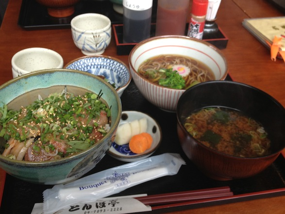
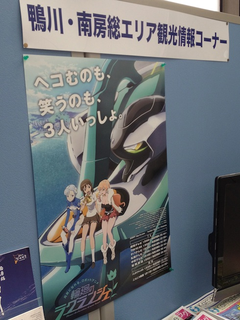
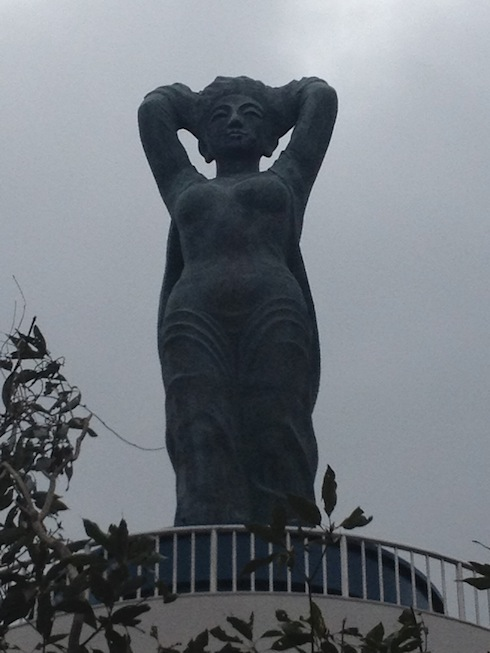
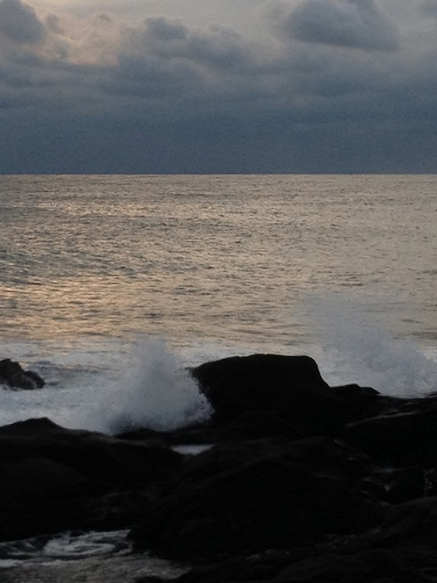

釣りクイズ…が化けて鴨川散策に
===============================

.. post:: 2012-03-11
   :category: Life
   :tags: 鴨川,観光,日帰り,千葉,

どうしてこうなった

今日釣りクイズのはずが、雨で釣り困難＆主催者の思いつき＆その場の流れで、鴨川まで行くことに。

えっと、「輪廻のラグランジェ」の舞台だっけ？
今日はじめて聞いたタイトルですが。

おおまかな内容が箇条書きで `あっちのエントリー <http://arawasi.blog9.fc2.com/blog-entry-2151.html>`_ にあるので、
詳しくはそっちでどうぞ。

巡礼の流れで魚見台公園の展望台まで行ってきたわけですが、駐車場→展望台まではともかく、
そこから浅間神社→妙見寺のルートでそのまま歩いて降りたのが少々体力ロスだった。

具体的にはこんな感じ↓

.. raw:: html

   
   
   <noscript><a href="http://www.mapion.co.jp/route/">キョリ測</a></noscript>

途中で海岸部まで降りたりしたので結構歩きました。アップダウンもかなり激しかったし。

足が重い……

いくつか写真
------------

   「とんぼ亭」のおらが丼

   鴨川市役所にて

   魚見台公園の展望台。乙女の像

   所変わって野島埼の海岸
