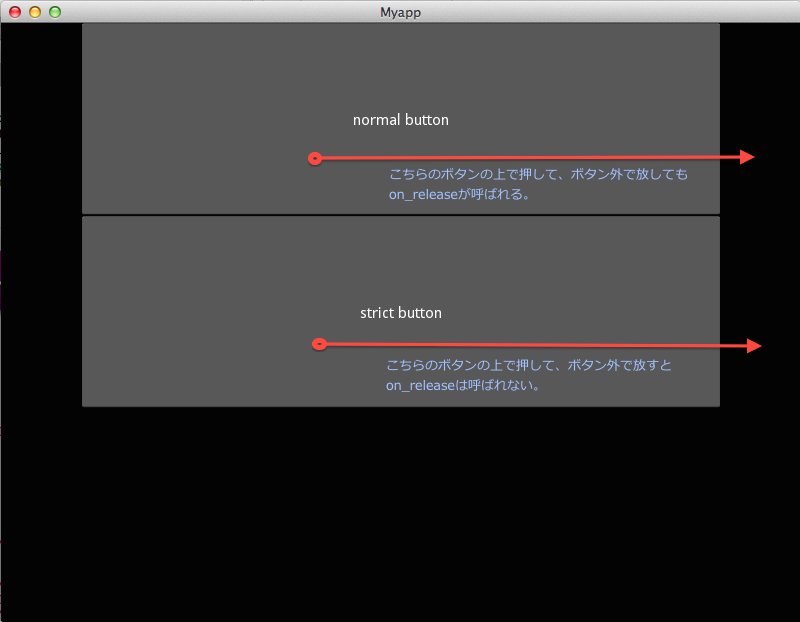

kivy-tips: 自分の中でのボタンのイメージ通りのUIX
================================================

.. post:: 2014-04-18
   :category: Tech
   :tags: Python,Kivy,OSS,

Kivyを少しだけいじってしばらく経つけど、なんかButtonオブジェクト [#f1]_  のreleaseイベントが、
ボタンを押してから放した場所がボタンの上でなくてもディスパッチされている模様。

https://github.com/kivy/kivy/blob/master/kivy/uix/behaviors.py#L108

.. code-block:: python

   def on_touch_up(self, touch):
       if touch.grab_current is not self:
           return super(ButtonBehavior, self).on_touch_up(touch)
       assert(self in touch.ud)
       touch.ungrab(self)
       self.last_touch = touch
       self._do_release()
       self.dispatch('on_release')
       return True

ここで、touch(最後にポインタが持っていた座標)を特に検証していないのが理由っぽいので、
ちゃんとボタンの範囲内で放したかを判定してdispatchを実行するような挙動に変えてみた。

https://github.com/attakei/kivy-chips/blob/master/strict_uix/strict/behaviors.py

こんな感じ。

.. code-block:: python

   from kivy.uix.behaviors import ButtonBehavior

   def is_released_on(released_pos, widget):
       touched_area_x = (widget.pos[0], widget.pos[0] + widget.size[0])
       touched_area_y = (widget.pos[1], widget.pos[1] + widget.size[1])
       if touched_area_x[0] < released_pos[0] < touched_area_x[1] and \
               touched_area_y[0] < released_pos[1] < touched_area_y[1]:
           return True
       return False

   class StrictButtonBehavior(ButtonBehavior):
       def on_touch_up(self, touch):
           if touch.grab_current is not self:
               return super(ButtonBehavior, self).on_touch_up(touch)
           assert(self in touch.ud)
           touch.ungrab(self)
           self.last_touch = touch
           self._do_release()
           if is_released_on(touch.pos, self):
               self.dispatch('on_release')
           return True

以下、サンプルのキャプチャ

.. [#f1] 正確には、大本の振る舞いを定義したButtonBehavior
