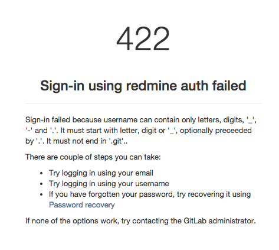

Redmine + gitlab 連携で躓いた(その2)
====================================

.. post:: 2014-10-23
   :category: Tech
   :tags: Ruby,Redmine,GitLab,OmniAuth,

前回の続き。

* redmine,gitlabを相乗りさせて、nginxをフロントに置く
* redmine-oauth-providerでredmineユーザによる認証を出来る仕組みを準備
* gitlab側はomniauth-redmineをインストールして、認証先にredmineを増やす

ここまで進めると、gitlabのログイン画面にredmine認証ボタンが出るようになり、
redmineでの利用許可後はgitlabに戻ってログインとユーザ作成が行われる……はずだった。

さて、ユーザ作成が行われない。

いろいろ調べた結果、影響元がだいたいこの辺にあった

* gitlabはユーザ作成後、gitリポジトリ作成などにはusernameを用いる
* username のフォーマットが「半角英数, '-', '_', '.'」で最後が.gitでないこと `[gitlabソース1] <https://github.com/gitlabhq/gitlabhq/blob/master/app/models/user.rb#L118>`_ `[gitlabソース2] <https://github.com/gitlabhq/gitlabhq/blob/master/lib/gitlab/regex.rb#L74>`_
* OmniAuth経由でユーザを作成する場合、oauthで取得したnicknameかメールアドレスのユーザ名が用いられる `[gitlabソース3] <https://github.com/gitlabhq/gitlabhq/blob/master/lib/gitlab/oauth/user.rb#L87>`_ `[gitlabソース4] <https://github.com/gitlabhq/gitlabhq/blob/master/lib/gitlab/oauth/auth_hash.rb#L31>`_
* omniauth-redmineはnicknameにredmineユーザのメールアドレスを使う `[omniauth-redmineソース] <https://github.com/suer/omniauth-redmine/blob/master/lib/omniauth/strategies/redmine.rb#L20>`_

プラグインを修正して対応。

https://github.com/attakei/omniauth-redmine ( `差分 <https://github.com/attakei/omniauth-redmine/compare/suer:master...master>`_ )

多分プラグイン側に若干の柔軟性をもたせる形で修正すれば、やっていけるはず。
ただし、READMEの修正をまだしていないのでプルリクエストを出していない。
※というか、出すのにビビって躊躇しているだけ
