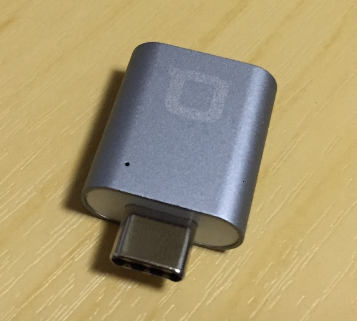
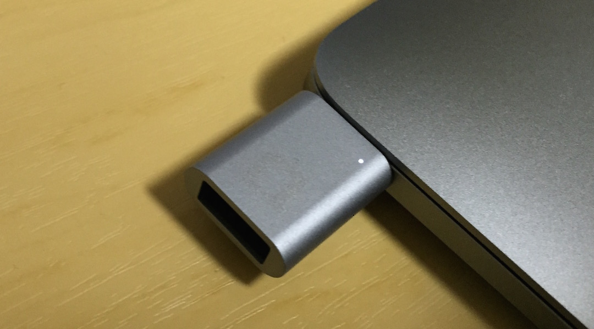
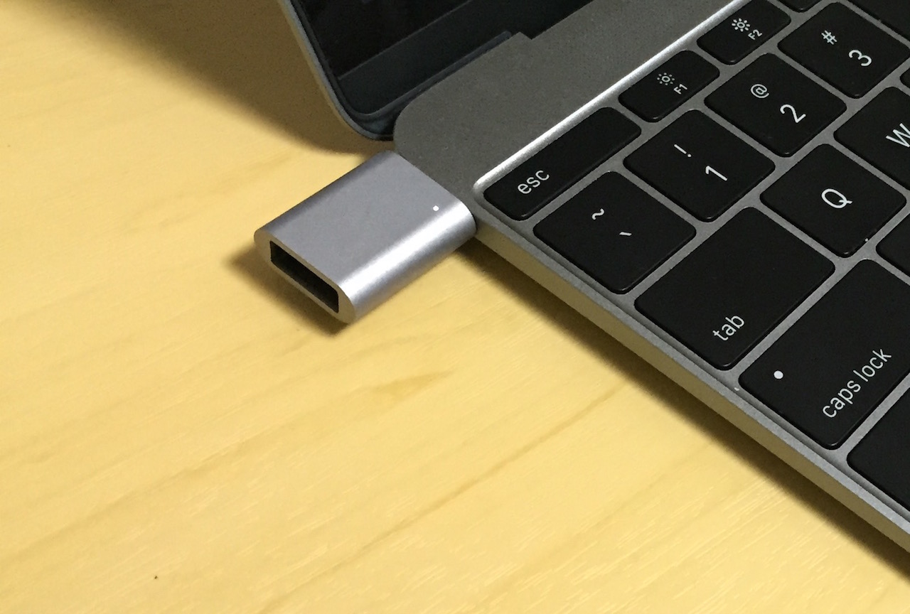
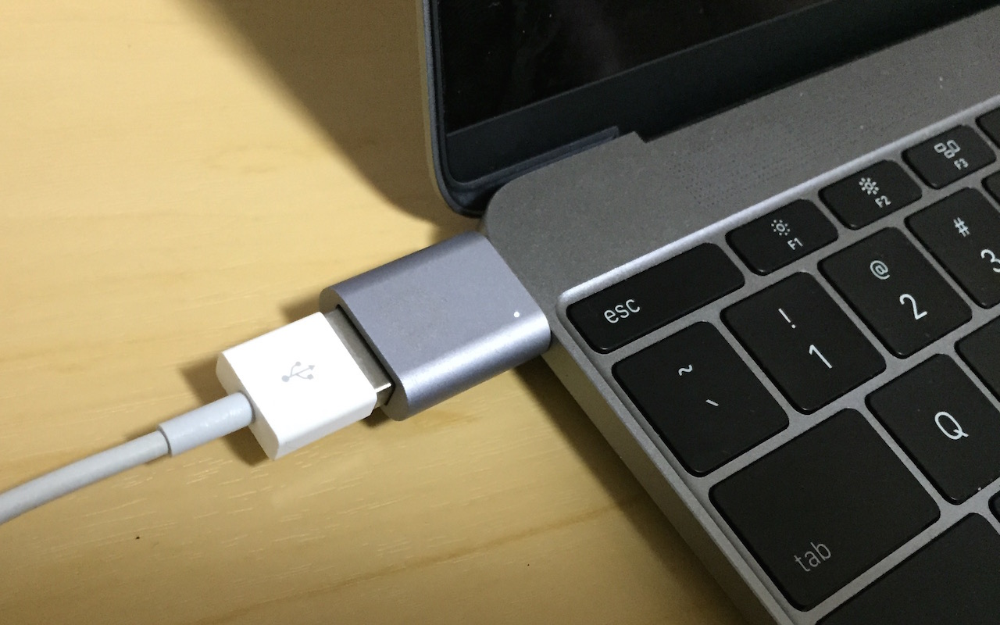

nonda mini adapter だけが来た
=============================

.. post:: 2015-10-28
   :category: Life
   :tags: ガジェット,USB-C

Kickstarter に出ていて国内でもニュースとなっていたサードパーティ製のMacBook向けハブの
`Hub+ USB-C Hub for the New MacBook 12" <http://www.nonda.co/products/usb-c-hub-for-apple-new-macbook-12-plus>`_
に出資してだいぶ前に資金集めに成功していました。
が、このたびおまけのmini adapterだけが届きました。

……本体は？

先に結論を書くと、カラーリングだけでなく作りもしっかりしたはしていたので、正規品のUSB-A=Cアダプタを持たずに済みそうなのはよさげ。
これならば、Hub+にも期待は持てるんじゃないかという印象。ただし本体の方に関して情報更新が少ないのは気がかり。

（以下、写真）

   MacBookに挿してみたところ。本体と色差分があるにはあるけど、そこまで気にならないレベル。
   光るポイントがある模様。

   当然だが、USB-Cのために裏返しにも挿せる。この場合だとランプは裏側に行くので全く目立たない。

   ちょっとだけ遠目から撮影してみた。案外出っ張る。

   iPhoneのケーブルとついないでみたところ。iPhoneへの給電は問題なく出来た。

   …ちょっと収まりが悪いかな？
