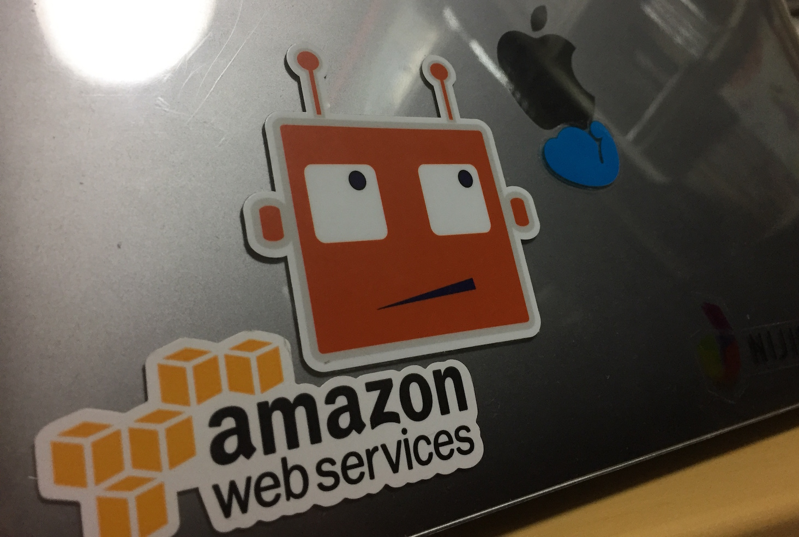

PyCon JP 2016に行ってた
=======================

.. post:: 2016-09-28
   :category: Tech
   :tags: 技術イベント,Python,PyCon JP,Errbot,

今年も行ってきました。

YouTubeライブのアーカイブがあるので、
当日パスしたセッションを後できちんと見たり、ほとんど頭に入らなかった英語セッションの復習などに使いたい。

会場の環境的には、前回と比べてWiFi環境が良くなくてちょっと気になった。
とはいえ、早稲田大学の設備をそのまま借りることができたのもあるので、あんまり文句は言えないけども。

招待講演
--------

SWEBOKなどに関するセッション。

* 上位15言語のシェアはここ数年で、大きく下がっている
* 1個のプロジェクトで４言語ぐらいは使われる

あたりの話はぼんやりと体感していて、サーバサイド言語だけではWebサービスとして成立しにくいのがよく分かる。

ただ、言語間の翻訳となるとどうしても懐疑的にならざるをえなかった。異なるパラダイム言語間で翻訳できるのを待ってはみたいけど。

GUI付与・EXE化
--------------

社内の立ち位置的にバックオフィス系の人たちとのやりとりが多いのもあって、ちょっと興味を持って聞いてきた。

PyInstallerにしても、使うパッケージとPythonランタイムを丸ごとフリージングする以上どうしてもファイルサイズの肥大化は避けられなさそう。
可能であればデスクトップ上で使えるようにするのが理想だけど、やっぱりWebに逃げたほうが無難かもしれない。

ErrBot
------

* 英語はさっぱりだったけど、もともとErrBot使っていたのとスライドがわかりやすいのでぼんやり理解はできた。
* どちらかというと、2日目にだけど少しだけ話す機会を作れたことが最大の収穫。ステッカーもらった

野球
----

こういう身近というか物質的なテーマを使ってあれこれやっているのを見ると、別のテーマ使って色々とやってみたくはなる。
それにしてもMLBはいろんなデータをオープンで出しているのだなぁと感心するわ。

メタプログラミング
------------------

使ってたり使っていなかったりすることが多い分野。知っとくと損はしない類のものなので、後でもう一回スライド見返したいやつ。

   もらったステッカーを早速貼ってる

参考
----

* `公式サイト <https://pycon.jp/2016/ja/>`_
